# Swatches

Various swatch collections.

## Color Cubes

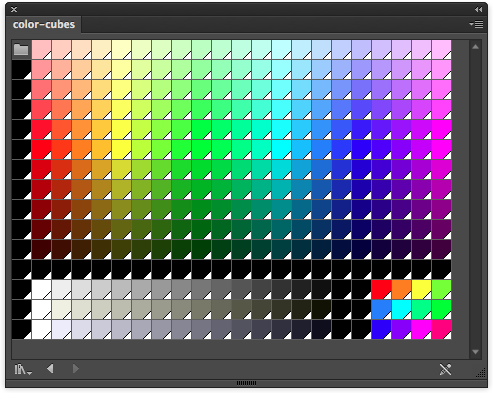

## Vintage (collection)

All the vintage video game console swatch libraries listed here, all in one file sorted into groups:

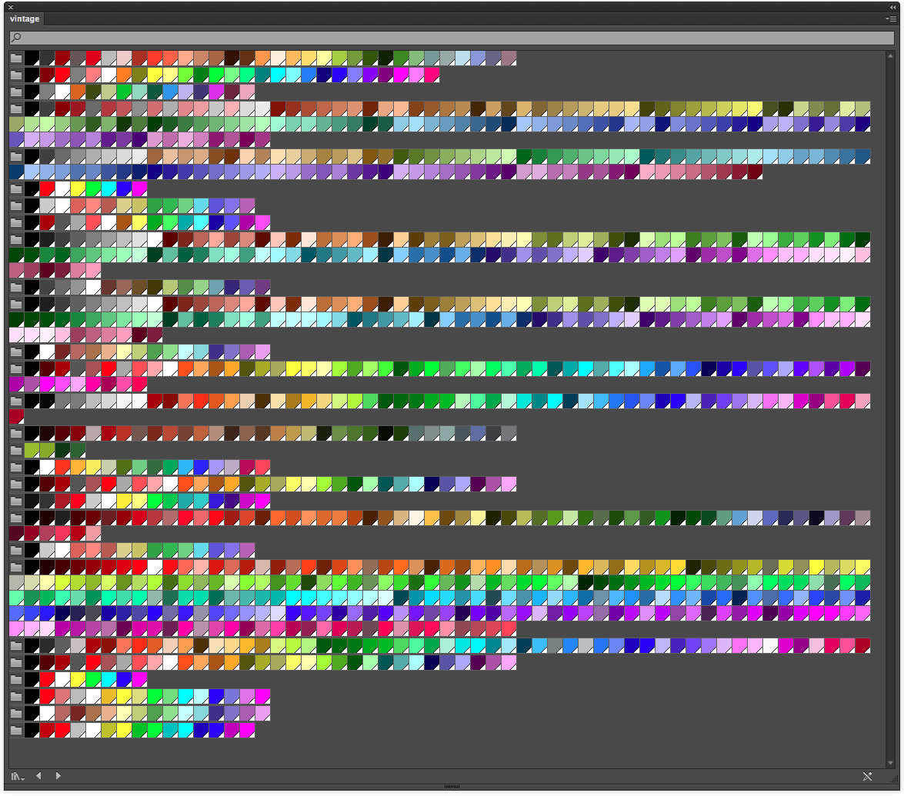

## Sega Master System

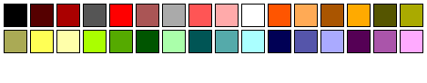

## Game Boy

## NES

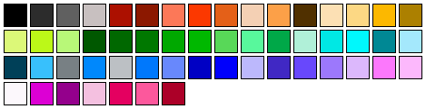

## Web2

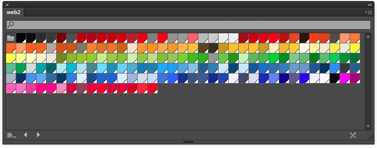

## Skin

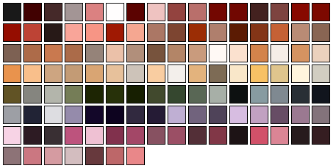

## Fun

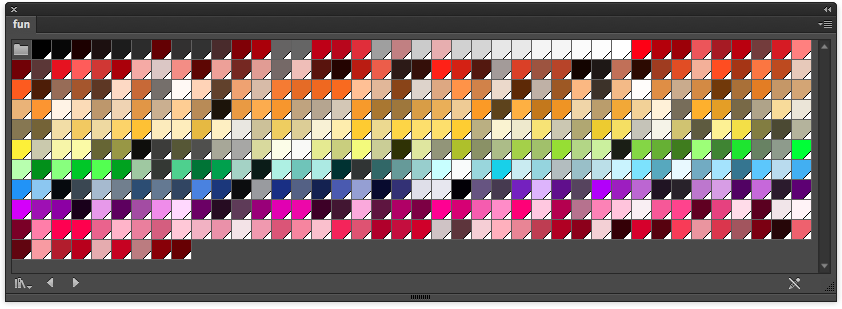

## ZX Spectrum

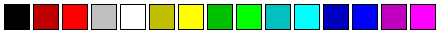

## Vic 20

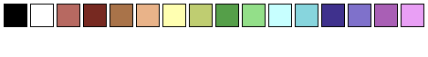

## Thomson MO5

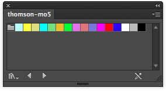

## Tele Text

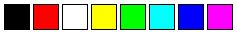

## MSX2

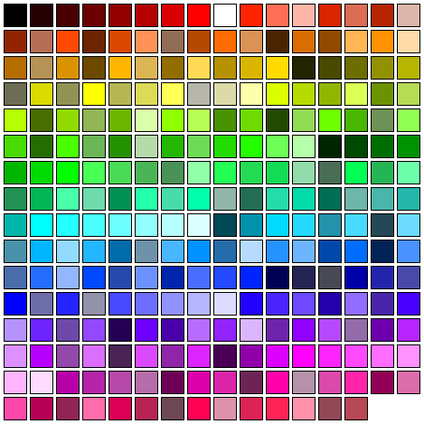

## MSX

## Mega Drive

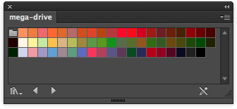

## Mattel Aquarius

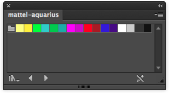

## Master System

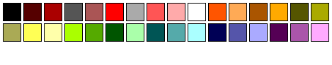

## Intellivision

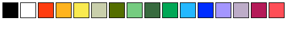

## Game Boy Color

## Famicom

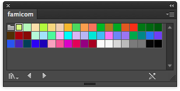

## Enhanced Graphics Adapter

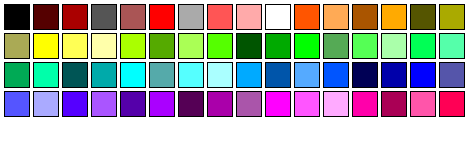

## Commodore Vic 20

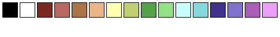

## Commodore Plus4

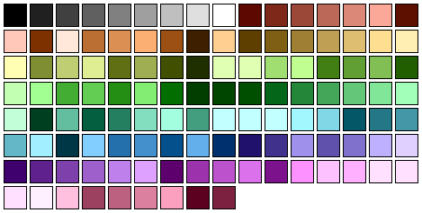

## Commodore 64

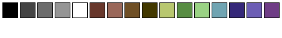

## Color Graphics Adapter

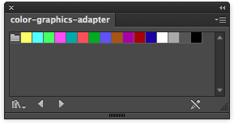

## Colecovision

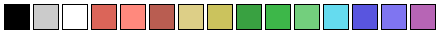

## BBC Micro

## Atari 2600 NTSC

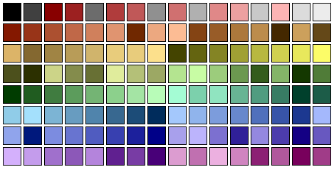

## Atari 2600 PAL

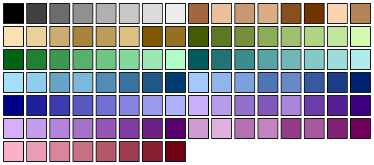

## Apple ii

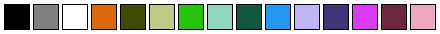

## Amstrad CPC

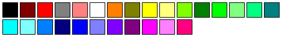

## Amiga

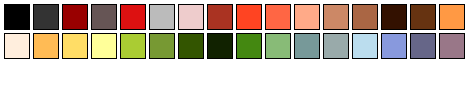

## Grayscale Extended

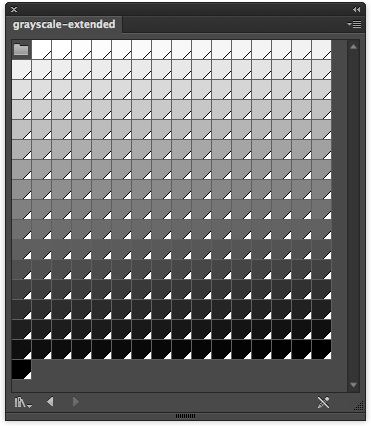

## Grayscale

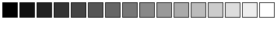

## Seperator

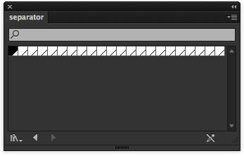

## Default

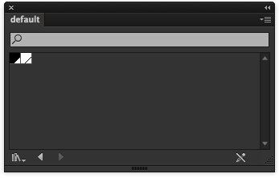
