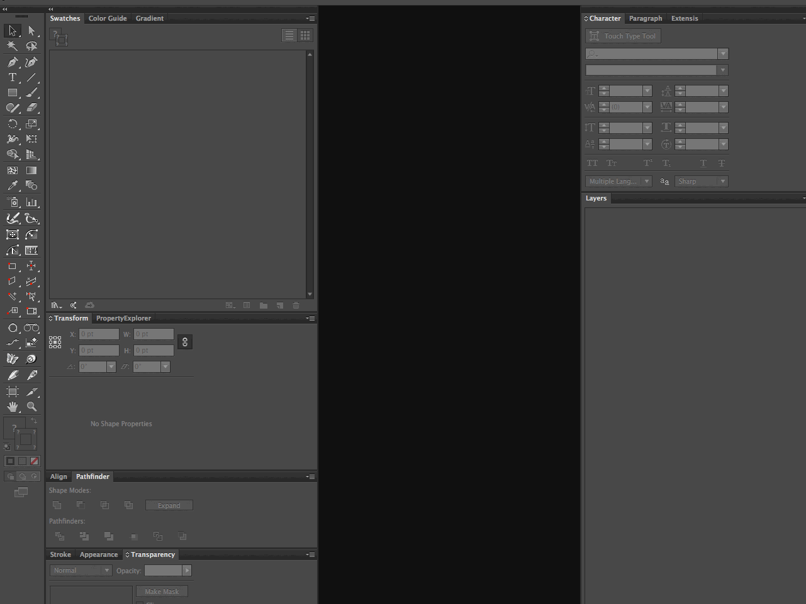

# Swatches

**Various swatch collections.**

## Installation

From the command line, run:

```bash
bash <(curl -sL https://git.io/vzovJ)
```

This will install all Adobe Swatch Exchange swatches from this repo into your `/Applications/Adobe\ Illustrator CC\ 20XX/Presets.localized/en_US/Swatches/` directory.

Restart Illustrator and open the swatches palette. From the palette fly-out menu, choose <kbd>Open Swatch Library</kbd> and pick a swatch palette from the `@mhulse` directory:



**Tip:** From an opened swatch library palette window, choose `Persistent` from the fly-out menu and dock the tab to your UI; next time Illustrator opens that palette will be loaded and visible.

## Files

### [colors](colors/)

> Miscellaneous colorful colors.

### [crafts](crafts/)

> Arts and crafts!

### [games](games/)

> Video game consoles.

### [grays](grays/)

> Grayscale palettes.

### [skins](skins/)

> Skintones.

### [utilities](utilities/)

> Utility swatches for use in making combination palettes.

### [interwebs](interwebs/)

> Internet-related swatches.

---

Copyright © 2016 [Michael Hulse](http://mky.io).

Licensed under the Apache License, Version 2.0 (the “License”); you may not use this work except in compliance with the License. You may obtain a copy of the License in the LICENSE file, or at:

[http://www.apache.org/licenses/LICENSE-2.0](http://www.apache.org/licenses/LICENSE-2.0)

Unless required by applicable law or agreed to in writing, software distributed under the License is distributed on an “AS IS” BASIS, WITHOUT WARRANTIES OR CONDITIONS OF ANY KIND, either express or implied. See the License for the specific language governing permissions and limitations under the License.


