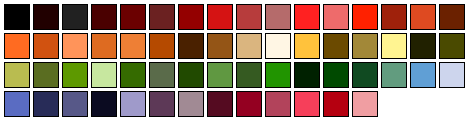
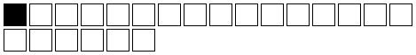
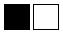

# Swatches

Various swatch collections.

## Color Cubes

## Vintage (collection)

All the vintage video game console swatch libraries listed here, all in one file sorted into groups:

## Sega Master System

## Game Boy

## NES

## Web2

## Skin

## Fun

## ZX Spectrum

## Vic 20

## Thomson MO5

## Tele Text

## MSX2

## MSX

## Mega Drive

## Mattel Aquarius

## Master System

## Intellivision

## Game Boy Color

## Famicom

## Enhanced Graphics Adapter

## Commodore Vic 20

## Commodore Plus4

## Commodore 64

## Color Graphics Adapter

## Colecovision

## BBC Micro

## Atari 2600 NTSC

## Atari 2600 PAL

## Apple ii

## Amstrad CPC

## Amiga

## Grayscale Extended

## Grayscale

## Seperator

## Default

