## Vintage (collection)

All the vintage video game console swatch libraries listed here, all in one file sorted into groups:

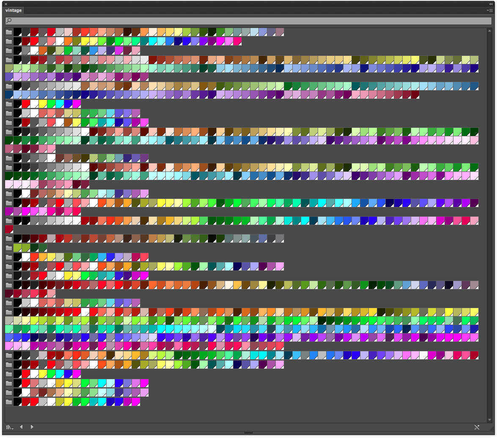

## Sega Master System

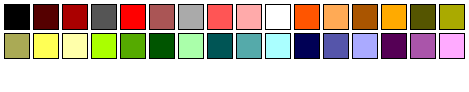

## Game Boy

## NES

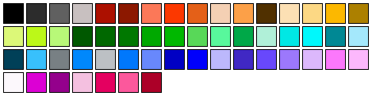

## ZX Spectrum

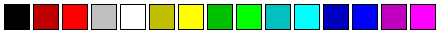

## Vic 20

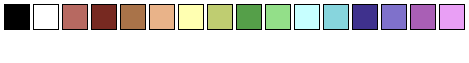

## Thomson MO5

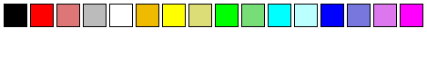

## Tele Text

## MSX2

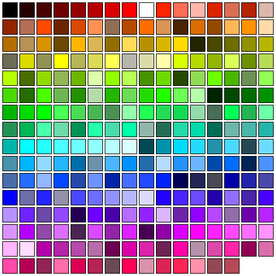

## MSX

## Mega Drive

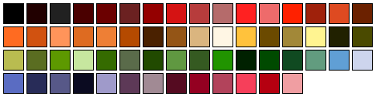

## Mattel Aquarius

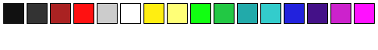

## Master System

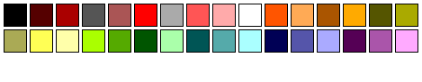

## Intellivision

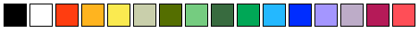

## Game Boy Color

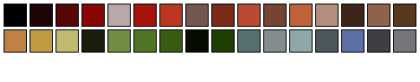

## Famicom

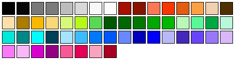

## Enhanced Graphics Adapter

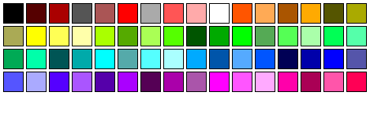

## Commodore Vic 20

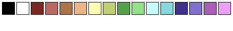

## Commodore Plus4

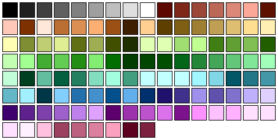

## Commodore 64

## Color Graphics Adapter

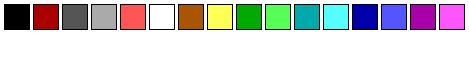

## Colecovision

## BBC Micro

## Atari 2600 NTSC

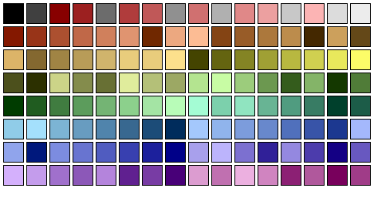

## Atari 2600 PAL

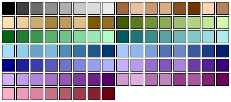

## Apple ii

## Amstrad CPC

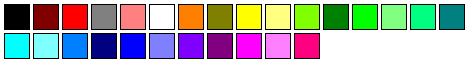

## Amiga

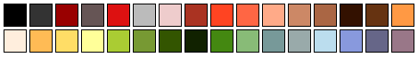
